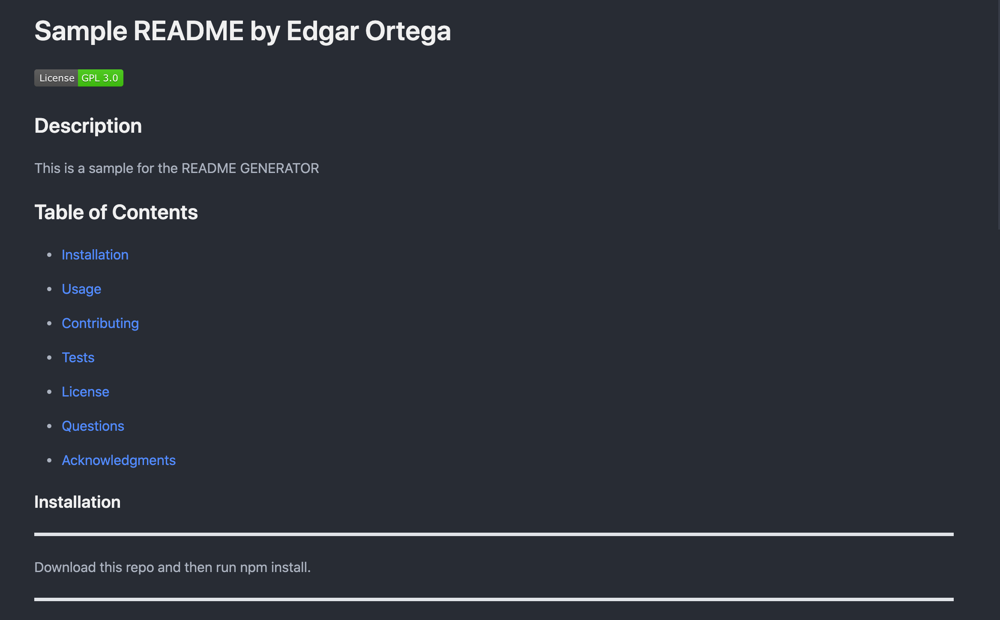
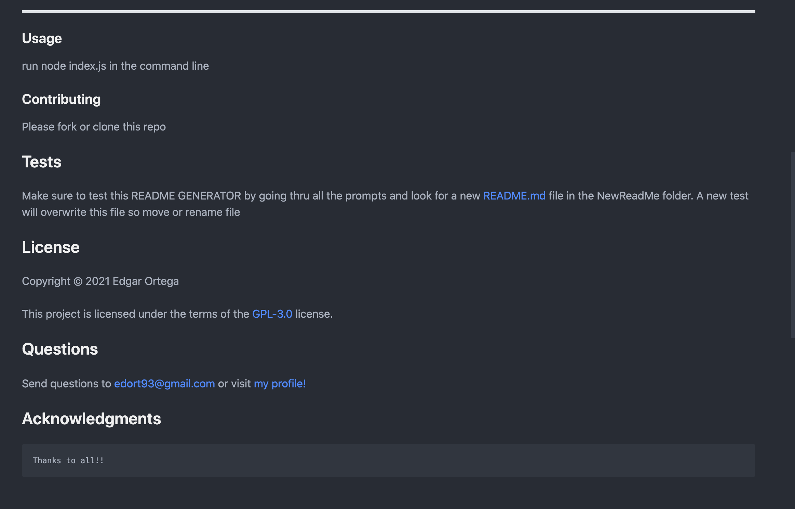
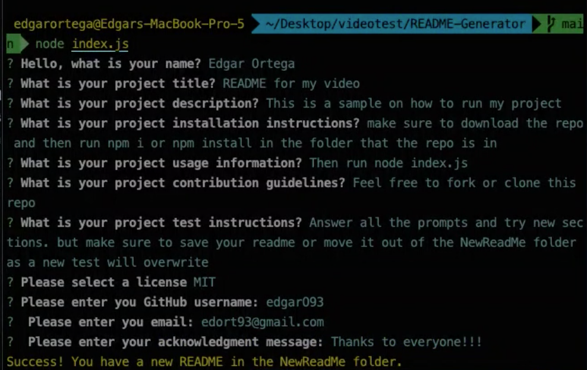
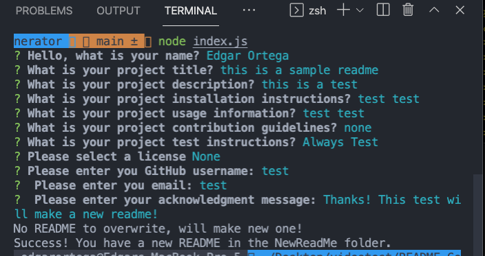

# README-Generator

[](https://opensource.org/licenses/MIT)

## Description
This README Generator is powered by Node.js, JavaScript, jQuery and dynamic HTML. This project will allow users to quickly create a README. I enjoyed creating this project as I learned alot more about Node.js and using packages such as NPM. It was challenging to write this without having the console window of the browswer. I was able to leverage my JavaScript acknowledge to execute this project. I learned alot more on READMEs as well. In future versions, I would like to increase the license and make the generator more customizable. 

## Table of Contents

- [Installation](#installation)
- [Usage](#usage)
- [Contribute](#contribute)
- [Questions](#questions)
- [Test](#test)
- [Screenshot](#screenshot)
- [Video](#video)
- [License](#license)
- [Questions](#questions)
- [Acknowledgments](#acknowledgments)

### Installation
After downloading this repository, go into the folder of this project. Then run npm install or i.

### Usage
You can then run the program by running node index.js and you will see prompts start appearing.

### Contribute
Feel free to fork or clone this repo and make your own versions.

## Test
Please test and let me know if of any bugs. If you would like to keep your README.md make sure to move out of folder or rename. This program will overwrite the README in the NewReadMe folder or create a new README.md if there is no path.

## Screenshot 
Sample README



View of Terminal


View of VS CODE Integrated Terminal with no README in NewReadMe folder. It will create new README.


## Video
[

## License

Copyright &copy; 2021 Edgar Ortega

This project is licensed under the terms of the <a href="https://opensource.org/licenses/MIT" target= "_blank" > MIT </a> license.

### Questions

Send questions to edort93@gmail.com or visit <a href="https://github.com/edgarO93" target= "_blank" >my profile </a><br>

## Acknowlegments

```
I would like to thank our substitute class intructor Tom and TAs Rad and Irwin as well online resources such as W3 schools, MDN Web Docs, and Stack Overflow.
```
